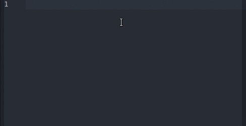

# Self-Closing Tag

Plugin for Atom code editor which deletes closing HTML tag if you self-close the corresponding opening tag. Self-closing is done by typing "/" before opening tag's ">".

Does not support multiple cursors.

## Known issues with other atom plugins

* [atom-double-tag](https://github.com/dsandstrom/atom-double-tag): doesn't work properly unless you insert space after opening tag name and before you type slash (tags look prettier that way anyway)
